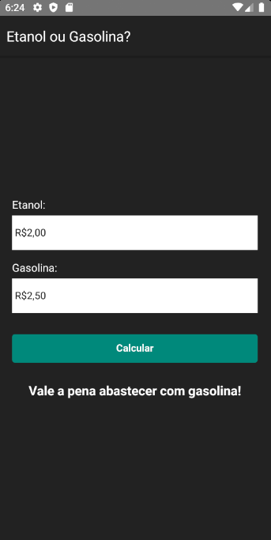

## Módulo de Desenvolvimento Mobile (React Native) - Uni-FACEF.

- Calculadora que verifica se compensa abastecer com álcool ou gasolina.

<h1 align="center">  
  
</h1>

## Instalação / Configuração

- Pré-requisitos: Para rodar o projeto react-native em seu celular ou emulador você precisa de algumas
configurações mais especificas, recomendo este link
(https://react-native.rocketseat.dev/) caso ainda não possua as configurações recomendadas em sua maquina.

1. Instale
   [Git](http://git-scm.com/downloads) e
   [NodeJS](http://nodejs.org/download/),
   caso você não os tenha ainda.

2. Instale todas as dependências:

   ```sh
   $ npm install
   ```

3. E finalmente rode:

   ```sh
   $ react-native run-android (Android)
   ou
   $ react-native run-ios (IOS)
   ```
